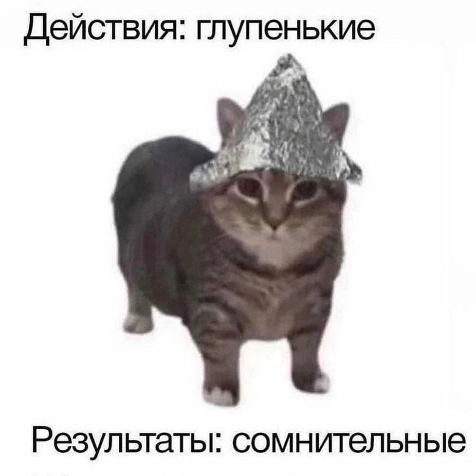

# Заголовок 1

1. Правило номер один
2. Правило номер два

Это список:  
* ляляля
* труляля
    * мяу
    * мяу-мяу
* опля
***
Это *текст*. Почти как **лорем испум**, но ***прикольней***. И на русском языке.

` это выделенный текст
`

```
А это очень выделенный текст.
Прям как код.
В такие окошки надо писать код.
```
*** 
>Это цитата!  
Вот такая важная цитата


Ну и конечно [ссылочка](https://google.com)



А вот картинка со ссылкой:

[](https://www.google.com/)

Вот рандом таблица:

| Item       | In Stock | Price |
| :--------- | :------: | ----: |
| Python Hat |   True   | 23.99 |
| SQL Hat    |   True   | 23.99 |
